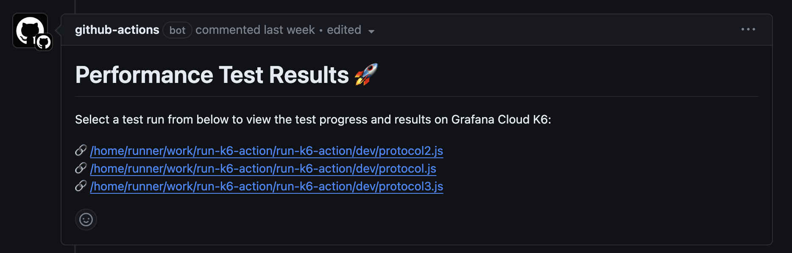

<div align="center">
  
  

  <br />
  Open source performance testing tool and SaaS for ambitious engineering teams.

</div>

# run-k6-action
> This GitHub Action is under active development 🧑‍🏭  
> Please, use https://github.com/grafana/k6-action instead

This action allows you to easily execute k6 tests as part of your GitHub Actions workflow. 

It is a wrapper over `k6 run`, with support for globs, parallel execution, fail-fast, and many other features.

> This action won't setup/install k6. That functionality is provided by [grafana/setup-k6-action](https://github.com/grafana/setup-k6-action)

## Inputs

The following inputs can be used as `step.with` key:

| Name | Type | Required | Description 
| --- | --- | --- | --- |
| `path` | string | `true` | Glob pattern to select one or multiple test scripts to run. <br/> e.g. `./tests/api*.js` <br/> One can also supply multiple patterns by separating them with new line.<br/><code>path: \|<br/>&nbsp;&nbsp;&nbsp;&nbsp;&nbsp;./tests/api*.js<br/>&nbsp;&nbsp;&nbsp;&nbsp;&nbsp;./tests/app*.js</code>
| `cloud-run-locally` | boolean | `false` | If `true`, the tests are executed locally and the results are uploaded to Grafana Cloud k6
| `parallel` | boolean | `false` | If `true` and multiple tests are executed, all them run in parallel. 
| `fail-fast` | boolean | `false` | If `true`, the whole pipeline fails as soon as the first test fails 
| `flags` | string | `false` | Additional flags to be passed on to the `k6 run` command.<br/>e.g. `--vus 10 --duration 20s`
| `cloud-comment-on-pr` | boolean | `false` | If `true`, the workflow comments a link to the cloud test run on the pull request (if present)
| `only-verify-scripts` | boolean | `false` | If `true`, only check if the test scripts are valid and skip the test execution'

## Usage

Following are some examples of using the workflow. 

### Basic

```yaml
on:
  push:

jobs:
  protocol:
    runs-on: ubuntu-latest
    steps:
      - uses: actions/checkout@v2
      - uses: grafana/setup-k6-action@v1
        with:
          k6-version: "0.49.0"
      - uses: grafana/run-k6-action@v1
        with:
          path: |
            ./tests/api*.js
```

#### Grafana Cloud k6 integration

To send the results to Grafana Cloud k6, you need to set the GCk6 environment variables.

```yaml
on:
  push:

jobs:
  protocol:
    runs-on: ubuntu-latest
    steps:
      - uses: actions/checkout@v2
      - uses: grafana/setup-k6-action@v1
        with:
          k6-version: "0.49.0"
      - uses: grafana/run-k6-action@v1
        env:
          K6_CLOUD_TOKEN: ${{ secrets.K6_CLOUD_TOKEN }}
          K6_CLOUD_PROJECT_ID: ${{ secrets.K6_CLOUD_PROJECT_ID }}
        with:
          path: |
            ./tests/api*.js
```

By default, the action will run k6 locally and send the results to Grafana Cloud k6. If you want to run the tests in our Cloud instances, you need to change the `cloud-run-locally` input to `false`:

```yaml
- uses: grafana/run-k6-action@v1
  env:
    K6_CLOUD_TOKEN: ${{ secrets.K6_CLOUD_TOKEN }}
    K6_CLOUD_PROJECT_ID: ${{ secrets.K6_CLOUD_PROJECT_ID }}
  with:
    path: |
      ./tests/api*.js
    cloud-run-locally: false
```

### Advanced

```yaml
on:
  push:

jobs:
  protocol:
    runs-on: ubuntu-latest
    steps:
      - uses: actions/checkout@v2
      - uses: grafana/setup-k6-action@v1
        with:
          k6-version: "0.49.0"
          browser: true
      - uses: grafana/run-k6-action@v1
        with:
          path: |
            ./tests/api*.js
            ./tests/app*.js
          flags: --vus 10 --duration 20s # optional: flags to pass to to each k6 test (default: none)
          parallel: true # optional: run tests in parallel (default: false)
          fail-fast: false # optional: fail the step early if any test fails (default: true)
```

Comment Grafana cloud k6 test URL on PR 

```yaml
- uses: grafana/run-k6-action@v1
  env:
    K6_CLOUD_TOKEN: ${{ secrets.K6_CLOUD_TOKEN }}
    K6_CLOUD_PROJECT_ID: ${{ secrets.K6_CLOUD_PROJECT_ID }}
  with:
    path: |
      ./tests/api*.js
    cloud-run-locally: false
    cloud-comment-on-pr: true
```

<div align="center">
  
</div>